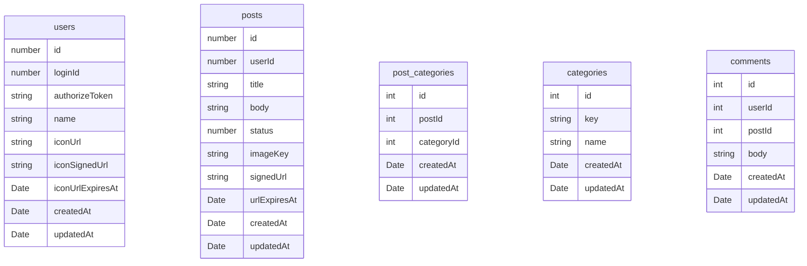

```mermaid
erDiagram
users {
  number id
  number loginId
  string authorizeToken
  string name
  string iconUrl
  string iconSignedUrl
  Date iconUrlExpiresAt
  Date createdAt
  Date updatedAt
}

posts {
  number id
  number userId
  string title
  string body
  number status
  string imageKey
  string signedUrl
  Date urlExpiresAt
  Date createdAt
  Date updatedAt
}

post_categories {
  int id
  int postId
  int categoryId
  Date createdAt
  Date updatedAt
}

categories {
  int id
  string key
  string name
  Date createdAt
  Date updatedAt
}

comments {
  int id
  int userId
  int postId
  string body
  Date createdAt
  Date updatedAt
}
```
