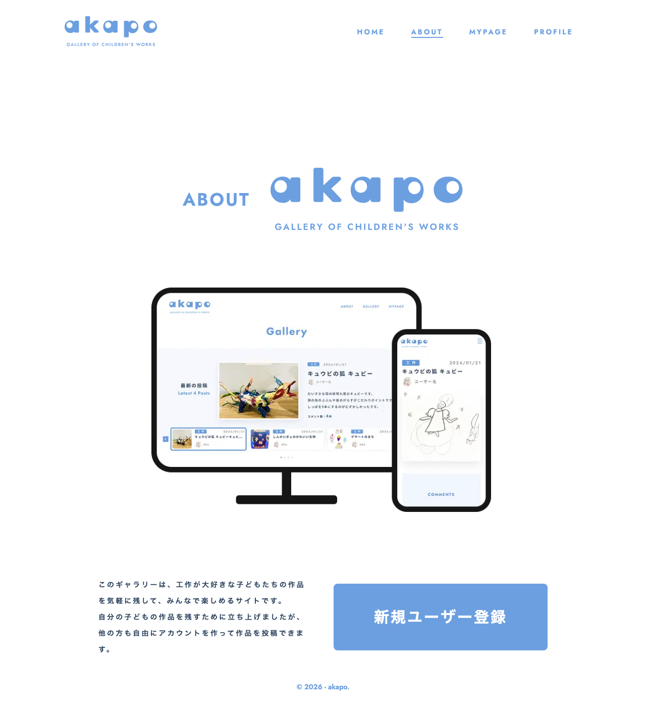

# 画面名
About

---

---

# 画面仕様

## 1. 画面概要
このページは、このサイトの概要を説明するためのページです。サイトの目的や特徴、新規ユーザー登録へのリンクが表示されます。

## 2. URL
`/about`

## 3. フォーム項目・表示要素
- サイトのロゴ
- 「ABOUT」のタイトル
- サイトの説明文
- 新規ユーザー登録ボタン

## 4. 初期表示・デフォルト値
- 特に設定はありません。

## 5. ユーザー操作
- 新規ユーザー登録ボタンをクリックすると、新規ユーザー登録ページ(`/signup`)に遷移します。

## 6. バリデーション・エラーハンドリング
- 特にありません。

## 7. 画面遷移
- 新規ユーザー登録ボタンをクリックすると、新規ユーザー登録ページ(`/signup`)に遷移します。

## 8. 使用しているコンポーネント
- `Image`: Next.jsの画像表示コンポーネント
- `Link`: Next.jsのリンクコンポーネント
- `Button`: 共通のボタンコンポーネント

## 9. 使用しているHooks / Stores / API / Schema
- 特にありません。

## 10. 補足・制約
- 特にありません。

<!-- META -->
- 画面ID: about
- 最終更新日: 2026-03-15
<!-- /META -->