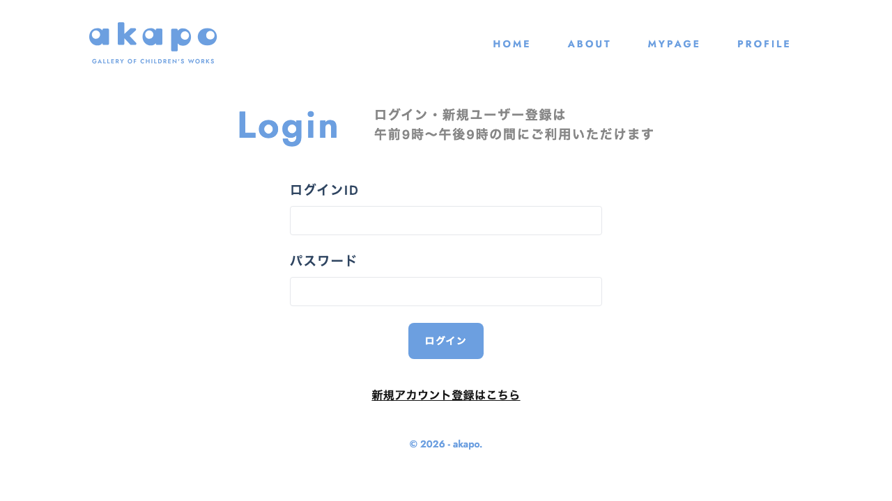

# Feature名

auth



## Feature概要

ログインおよび新規ユーザー登録を担う認証 Feature。ログインフォームの送信・セッション確立・ユーザープロファイルの初期化と、新規ユーザーの登録フォーム送信・画像圧縮・API 呼び出しの2機能を提供する。

## 主要な責務

- ログインID・パスワードによる認証処理とトークン取得
- 認証後にユーザープロファイルを取得し `AuthStore` へ保存
- 新規ユーザーのログインID・パスワード・アカウント名・アイコン画像の登録
- アイコン画像の圧縮（`browser-image-compression`）と `FileReader` によるプレビュー表示
- ログイン・登録ともに利用時間制限（午前9時〜午後9時）の案内をUIで表示

## 提供するコンポーネント

| コンポーネント | 説明 |
|---|---|
| `LoginPage` | ログインページのルートコンポーネント。`LoginForm` を内包 |
| `LoginForm` | ログインID・パスワードのフォーム。送信後にトークン取得・ユーザー情報取得・`/mypage` へリダイレクト |
| `CreateUserPage` | 新規ユーザー登録ページのルートコンポーネント。`CreateUser` を内包 |
| `CreateUser` | 登録フォーム。ファイル選択・プレビュー表示・画像圧縮・API 送信を担う |

## 提供するHooks

| Hook | 説明 |
|---|---|
| `useLoginForm` | `react-hook-form` + `zodResolver(NewLoginSchema)` によるログインフォーム管理。`mode: "onBlur"` でバリデーション |
| `useUserForm` | `react-hook-form` + `zodResolver(NewUserSchema)` による登録フォーム管理 |

## 状態管理（Store）

| Store | 使用箇所 | 操作 |
|---|---|---|
| `useAuthStore` | `LoginForm` | `setUserProfile` でログイン後のユーザー情報をセット |

## 使用している外部依存

| 依存 | 用途 |
|---|---|
| `next/navigation` (`useRouter`) | ログイン成功後 `/mypage`、登録成功後 `/login` へリダイレクト |
| `next/link` (`Link`) | `/signup` へのリンク |
| `react-hot-toast` | 成功・失敗トースト通知 |
| `browser-image-compression` | アイコン画像の圧縮（`IMAGE_COMPRESSION_OPTIONS` を使用） |
| `@hookform/resolvers/zod` | Zod スキーマによるフォームバリデーション |
| `@/shared/schemas` (`NewLogin`, `NewLoginSchema`, `NewUser`, `NewUserSchema`) | バリデーションスキーマ |
| `@/shared/api/fetchData` (`createLogin`, `fetchUserData`, `createUser`) | API 呼び出し |
| `@/shared/lib/validateImageFile` | ファイルバリデーション |
| `@/shared/constants/image` (`IMAGE_COMPRESSION_OPTIONS`) | 画像圧縮オプション |
| `@/shared/components/button` (`Button`) | 共通ボタンコンポーネント |
| `@/shared/components/font` (`jost`) | タイトルフォント |

## 使用されている箇所（routes）

| ルート | 説明 |
|---|---|
| `/login` | `LoginPage` が表示される |
| `/signup` | `CreateUserPage` が表示される |

## 補足・制約

- ログイン処理中は `isSubmitting` フラグでボタンを `disabled` にし二重送信を防ぐ
- `LoginForm` はトークンが `null` の場合（APIは成功したがトークン未取得）もエラートーストを表示する
- `CreateUser` は `validateImageFile` によりファイルが未選択またはバリデーション失敗時は送信しない
- フォームのバリデーションモードはどちらも `"onBlur"`

<!-- META -->
Feature ID: auth
最終更新日: 2026-04-11
<!-- /META -->

# 実装コード

### login/LoginPage.tsx

```tsx
import { jost } from "@/shared/components/font";
import Link from "next/link";
import LoginForm from "./components/LoginForm";

export default function LoginPage() {
  return (
    <>
      <div className="m-4 wrapper">
        <div className="md:flex justify-center items-center gap-12">
          <h3
            className={`${jost.className} md:text-[53px] text-[22px] text-[#6C9FE0] tracking-[.2rem] font-bold`}
          >
            Login
          </h3>
          <p className="text-[#878787] md:text-lg font-semibold tracking-widest md:mt-0 mt-3">
            ログイン・新規ユーザー登録は
            <br />
            午前9時〜午後9時の間にご利用いただけます
          </p>
        </div>

        <div className="mt-6">
          <div className="max-w-[448px] mx-auto">
            <LoginForm />
          </div>
          <div className="mt-10 text-center">
            <h2 className="font-bold tracking-wide text-[#161616]">
              <Link href="/signup" className="underline">
                新規アカウント登録はこちら
              </Link>
            </h2>
          </div>
        </div>
      </div>
    </>
  );
}
```

### register/CreateUserPage.tsx

```tsx
import { jost } from "@/shared/components/font";
import CreateUser from "./components/CreateUser";

export default function CreateUserPage() {
  return (
    <>
      <div className="m-4 wrapper">
        <div className="md:flex justify-center items-center gap-12">
          <h3
            className={`${jost.className} md:text-[53px] text-[22px] text-[#6C9FE0] tracking-[.2rem] font-bold`}
          >
            Signin
          </h3>
          <p className="text-[#878787] md:text-lg font-semibold tracking-widest md:mt-0 mt-3">
            ログイン・新規ユーザー登録は
            <br />
            午前9時〜午後9時の間にご利用いただけます
          </p>
        </div>
        <div className="text-center mt-6">
          <h3 className="font-semibold text-2xl tracking-widest text-[#161616]">
            新規ユーザー登録
          </h3>
        </div>
        <div className="max-w-[448px] mx-auto mt-9">
          <CreateUser />
        </div>
      </div>
    </>
  );
}
```

### login/hooks/useLoginForm.tsx

```tsx
import { useForm } from "react-hook-form";
import { zodResolver } from "@hookform/resolvers/zod";
import { NewLogin, NewLoginSchema } from "@/shared/schemas";

export const useLoginForm = (defaultValues?: Partial<NewLogin>) => {
  const {
    register,
    handleSubmit,
    formState: { errors },
    reset,
  } = useForm<NewLogin>({
    resolver: zodResolver(NewLoginSchema),
    mode: "onBlur",
    defaultValues: defaultValues || {
      loginId: "",
      password: "",
    },
  });

  return { register, handleSubmit, errors, reset };
};
```

### register/hooks/useUserForm.ts

```ts
import { useForm } from "react-hook-form";
import { zodResolver } from "@hookform/resolvers/zod";
import { NewUser, NewUserSchema } from "@/shared/schemas";

export const useUserForm = (defaultValues?: Partial<NewUser>) => {
  const {
    register,
    handleSubmit,
    formState: { errors },
    control,
    reset,
  } = useForm<NewUser>({
    resolver: zodResolver(NewUserSchema),
    mode: "onBlur",
    defaultValues: defaultValues || {
      loginId: "",
      name: "",
      password: "",
    },
  });

  return { register, handleSubmit, control, errors, reset };
};
```
