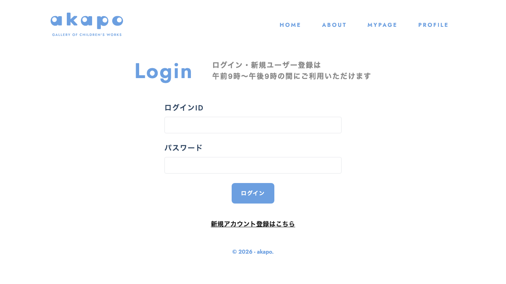

# 画面名
ログイン
---

---

# 必須構成

## 1. 画面概要
ユーザーがログインできる画面です。ログインIDとパスワードを入力し、ログインボタンをクリックすることで、ログインが完了します。

## 2. URL
/login

## 3. フォーム項目・表示要素
- ログインID (テキスト入力)
- パスワード (パスワード入力)
- ログインボタン

## 4. 初期表示・デフォルト値
- ログインID、パスワードの入力欄は空の状態で表示されます。

## 5. ユーザー操作
- ログインIDとパスワードを入力する
- ログインボタンをクリックする

## 6. バリデーション・エラーハンドリング
- ログインIDとパスワードは必須入力です。未入力の場合はエラーメッセージを表示します。
- ログイン処理に失敗した場合は、エラーメッセージを表示します。

## 7. 画面遷移
- ログイン成功時は、/mypage に遷移します。
- 新規アカウント登録ボタンをクリックすると、/signup に遷移します。

## 8. 使用しているコンポーネント
- LoginPage
- LoginForm
- Button

## 9. 使用しているHooks / Stores / API / Schema
- useLoginForm (カスタムフック)
- useAuthStore (ストア)
- createLogin (API)
- NewLogin (スキーマ)

## 10. 補足・制約
- ログイン・新規ユーザー登録は午前9時〜午後9時の間にご利用いただけます。

<!-- META -->
- 画面ID: login
- 最終更新日: 2026-03-15
<!-- /META -->

# 実装コード

### app/login/page.tsx
このファイルは、Next.js の App ルーティングを設定しています。ログインページのコンポーネントをエクスポートしています。

### features/auth/login/LoginPage.tsx
このファイルは、ログインページのメインコンポーネントです。ページのレイアウトと構造を定義しています。

- ページタイトルと説明文を表示しています。
- LoginForm コンポーネントを表示しています。
- 新規アカウント登録へのリンクを表示しています。

### features/auth/login/components/LoginForm.tsx
このファイルは、ログインフォームのコンポーネントです。

- ログインIDとパスワードの入力フォームを表示しています。
- 入力値のバリデーションを行っています。
- ログイン処理を行うボタンを表示しています。
- ログイン処理の状態を管理しています。

### features/auth/login/hooks/useLoginForm.tsx
このファイルは、ログインフォームのカスタムフックです。

- react-hook-form ライブラリを使用して、フォームの状態管理を行っています。
- Zod ライブラリを使用して、入力値のバリデーションを行っています。

### features/auth/login/api/createLogin.ts
このファイルは、ログイン API を呼び出す関数を定義しています。

### features/auth/login/api/index.ts
このファイルは、ログイン API 関数をエクスポートしています。