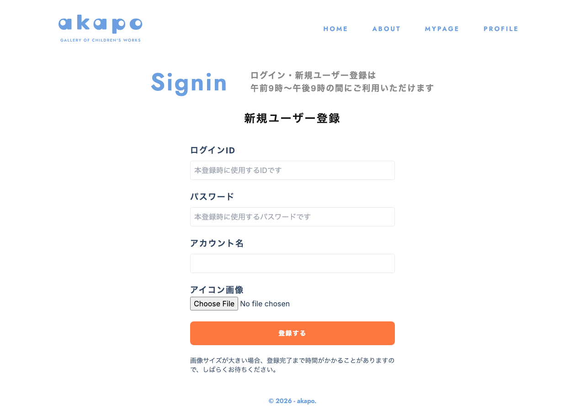

# 画面名
新規ユーザー作成

---

---

# 必須構成

1. **画面概要**
   - 新規ユーザー登録を行うための画面です。

2. **URL**
   - `/register`

3. **フォーム項目・表示要素**
   - ログインID
   - パスワード
   - アカウント名
   - アイコン画像

4. **初期表示・デフォルト値**
   - ログインID、パスワード、アカウント名のフォーム項目は空の状態で表示されます。
   - アイコン画像は初期表示では表示されません。

5. **ユーザー操作**
   - ログインID、パスワード、アカウント名を入力する
   - アイコン画像をアップロードする
   - 「登録する」ボタンをクリックする

6. **バリデーション・エラーハンドリング**
   - ログインID、パスワード、アカウント名の各項目は必須入力です。
   - アイコン画像のファイルサイズが大きい場合は、圧縮処理を行います。
   - 入力エラーがある場合は、エラーメッセージを表示します。
   - 登録処理中は「登録中...」と表示し、ボタンを無効化します。

7. **画面遷移**
   - 登録完了後は、ログイン画面(`/login`)に遷移します。

8. **使用しているコンポーネント**
   - `CreateUserPage`
   - `CreateUser`
   - `Button`

9. **使用しているHooks / Stores / API / Schema**
   - Hooks: `useUserForm`, `useRouter`, `useState`, `useEffect`
   - API: `createUser`
   - Schema: `NewUser`, `NewUserSchema`

10. **補足・制約**
    - 画像サイズが大きい場合、登録完了まで時間がかかることがあるため、ユーザーに待機を促す表示を行っています。
    - 登録時間が長い場合は、タイムアウトなどのエラーハンドリングも必要です。

<!-- META -->
- 画面ID: register
- 最終更新日: 2026-03-15
<!-- /META -->