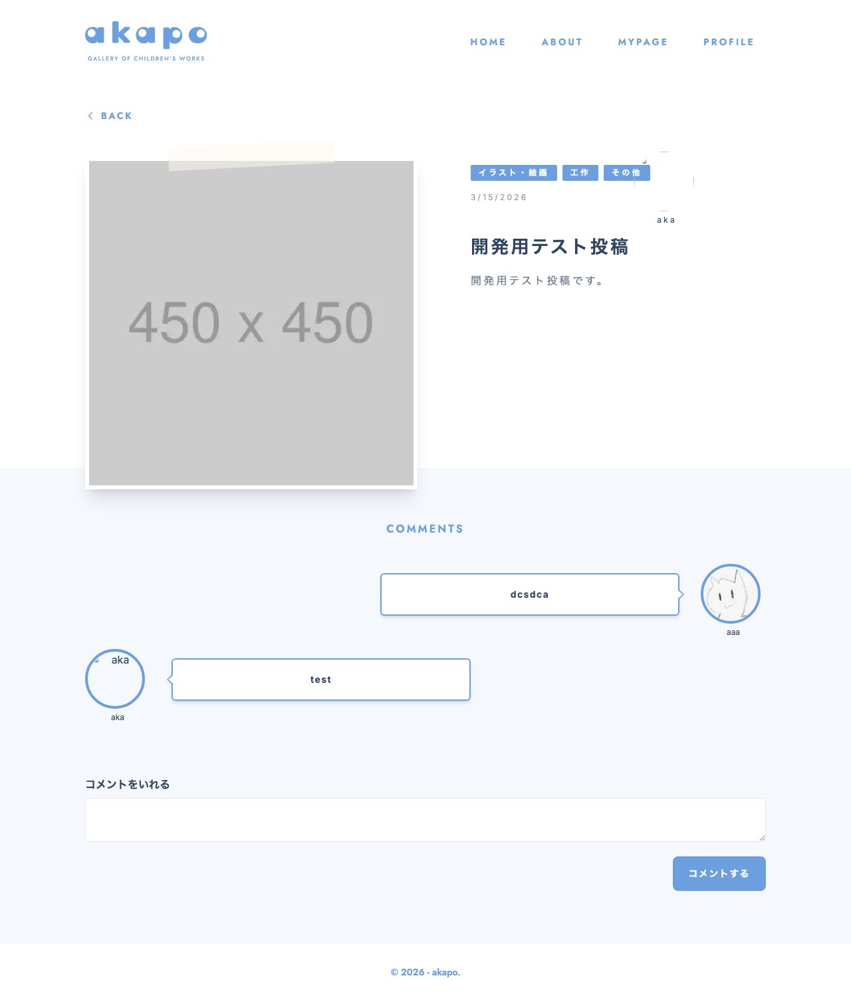

# comments

## Feature概要

投稿（Post）に対するコメントの作成・一覧表示・削除機能を提供するFeature。コメントの新規投稿フォームと、投稿に紐づくコメント一覧をチャット風の吹き出しUIで表示する。コメントの所有者判定により削除権限を制御し、投稿者（postUserId）かどうかで吹き出しの左右配置を切り替える。

## 主要な責務

| 責務 | 説明 |
|------|------|
| コメント作成 | テキストエリアから入力された本文を指定の投稿（postId）に対してAPIを通じて送信し、成功時にストアへ追加する |
| コメント一覧表示 | ストア（`useCommentStore`）に保持されたコメント配列をチャット風の吹き出しUIでレンダリングする |
| コメント削除 | ログインユーザー自身のコメントに対して削除ボタンを表示し、確認ダイアログの後にAPIを呼び出してストアから除去する |
| 投稿者判定による表示切替 | コメントの`userId`と`postUserId`を比較し、投稿者本人のコメントは左寄せ、それ以外は右寄せで吹き出しを表示する |
| 自コメント判定による削除権限制御 | コメントの`userId`とログインユーザーの`userProfile.id`を比較し、自身のコメントのみ削除ボタン（×アイコン）を表示する |

## 提供するコンポーネント

### `CreateComment`

| 項目 | 内容 |
|------|------|
| パス | `create/components/CreateComment.tsx` |
| Props | `CreateCommentProps` — `{ postId: number }` |
| ディレクティブ | `"use client"` |
| 説明 | コメント投稿フォーム。テキストエリアと送信ボタンで構成される。送信中は`isSubmitting`フラグによりボタンを無効化し、ラベルを「コメント送信中...」に変更する。送信成功時にストアの`addComment`でコメントを追加し、テキストエリアをクリアする。エラー時は`console.error`で出力する。 |

**内部状態:**

| State | 型 | 初期値 | 用途 |
|-------|----|--------|------|
| `body` | `string` | `""` | テキストエリアの入力値 |
| `isSubmitting` | `boolean` | `false` | 送信中の制御フラグ |

---

### `CommentsList`

| 項目 | 内容 |
|------|------|
| パス | `list/components/CommentsList.tsx` |
| Props | `CommentListProps` — `{ postUserId: number; postId: number }` |
| ディレクティブ | `"use client"` |
| 説明 | コメント一覧をチャット風吹き出しUIで表示する。コメントが0件の場合は「コメントをとうこうしてね」というメッセージを表示する。各コメントにはユーザーアイコン（丸型・ボーダー付き）とユーザー名が表示される。`isOwn`（投稿者本人のコメントか）で吹き出しの左右方向を切り替え、`userComment`（ログインユーザー自身のコメントか）で削除ボタンの表示を制御する。削除時は`window.confirm`で確認後、APIを呼び出しストアから除去する。 |

**判定ロジック:**

| 変数名 | 判定式 | 用途 |
|--------|--------|------|
| `isOwn` | `comment.userId === postUserId` | 吹き出しの左右配置を決定（投稿者本人＝左、それ以外＝右） |
| `userComment` | `comment.userId === userProfile?.id` | 削除ボタンの表示制御（自コメントのみ削除可能） |

## 提供するHooks

本Feature固有のカスタムHooksは定義されていない。共有ストアのHooks（`useCommentStore`、`useAuthStore`）を直接使用している。

## 状態管理（Store）

本Featureは以下の共有ストアに依存している。

### `useCommentStore`（`@/shared/stores`）

| 使用メンバー | 型（推定） | 使用箇所 | 用途 |
|-------------|-----------|---------|------|
| `comments` | `Comment[]` | `CommentsList` | コメント一覧の参照 |
| `addComment` | `(comment: Comment) => void` | `CreateComment` | 新規コメントの追加 |
| `removeComment` | `(commentId: number) => void` | `CommentsList` | コメントの削除 |

### `useAuthStore`（`@/shared/stores`）

| 使用メンバー | 型（推定） | 使用箇所 | 用途 |
|-------------|-----------|---------|------|
| `userProfile` | `{ id: number; ... } \| null` | `CommentsList` | ログインユーザーの特定（自コメント判定） |

## 使用している外部依存

| パッケージ / モジュール | 使用箇所 | 用途 |
|------------------------|---------|------|
| `react` | `CreateComment` | `useState` による状態管理 |
| `next/image` | `CommentsList` | ユーザーアイコン画像の最適化表示（`loading="lazy"`） |
| `react-hot-toast` | `CommentsList` | 削除成功・失敗時のトースト通知（`toast.success` / `toast.error`） |
| `@/shared/api/fetchData` | `createComment`, `deleteComments` | コメント作成・削除のAPI呼び出し（`createComment`, `deleteComments`関数を間接利用） |
| `@/shared/components/button` | `CreateComment` | 送信ボタンコンポーネント |
| `@/shared/stores` | `CreateComment`, `CommentsList` | `useCommentStore`, `useAuthStore` のストアHooks |
| `@/shared/types` | 各所 | `Comment`, `NewComment`, `CreateCommentProps`, `CommentListProps` 型定義 |

## 使用されている箇所（routes）

コードからは直接的なルート定義を読み取ることができない。`CreateComment`は`postId`、`CommentsList`は`postId`と`postUserId`をPropsとして受け取る設計であるため、投稿詳細ページ（Post Detail）から使用されることが想定される。

## 補足・制約

- **エラーハンドリングの差異**: `CreateComment`ではエラー時に`console.error`のみで処理しているのに対し、`CommentsList`の削除処理では`react-hot-toast`によるユーザー通知を行っている。エラー通知の方針が統一されていない。
- **コメントデータの初期化**: `useCommentStore`の`comments`配列の初期化（API取得・セット）は本Feature内では行われていない。親コンポーネントまたは別のFeature/ページ側でストアへのコメントデータのセットが必要である。
- **削除ボタンのアクセシビリティ**: 削除ボタンは`div`要素に`onClick`を設定しており、`button`要素やキーボードイベント、`aria-label`等が付与されていないため、アクセシビリティ上の考慮が不足している。
- **`comments && userComment`の条件式**: `CommentsList`内の削除ボタン表示条件に`comments &&`が含まれているが、`comments`はこの時点で必ず配列（truthyなオブジェクト）であるため、実質的に`userComment`のみが有効な条件となっている。
- **APIラッパーの構造**: `create/api/createComment.ts`および`list/api/deleteComments.ts`は`@/shared/api/fetchData`の関数を薄くラップしたものであり、Feature固有のドメインロジックは含んでいない。
- **吹き出しUIの三角形**: CSSのborderテクニックとTailwindのarbitrary propertiesを使用して、吹き出しの三角形（ポインタ）を実現している。三角形の内側に白い三角形を重ねることでボーダー付き吹き出しを表現している。デスクトップ（`md:`）でのみ三角形を表示する。
- **画像表示**: コメントユーザーのアイコンは`comment.user.iconSignedUrl`から署名付きURLで取得され、`next/image`の`Image`コンポーネントで90×90ピクセル・丸型・青ボーダー付きで表示される。

<!-- META -->
Feature ID: comments
最終更新日: 2026-04-13
<!-- /META -->