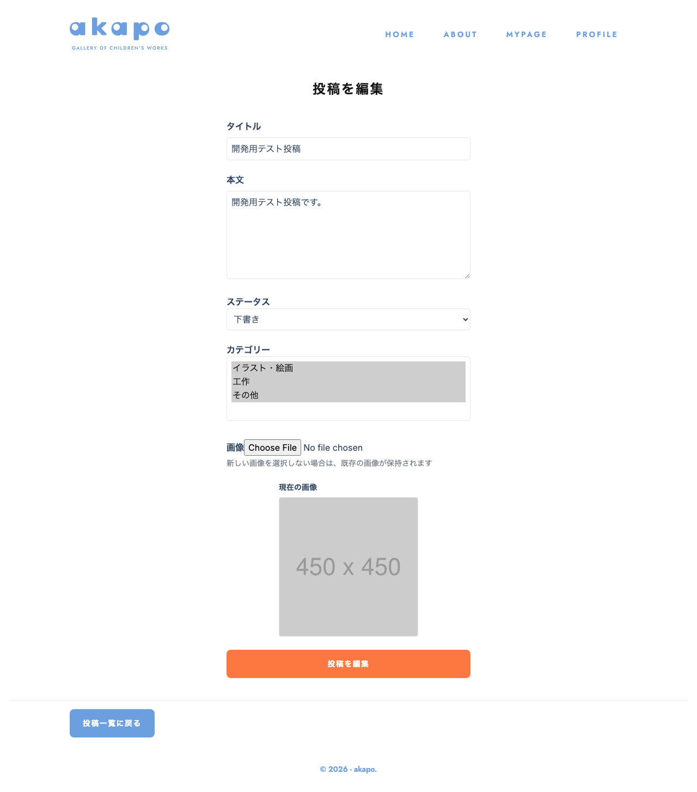

# 画面名
投稿編集

---

---

# 必須構成

## 1. 画面概要
投稿の編集を行う画面です。投稿のタイトル、本文、ステータス、カテゴリーの変更や、画像の変更が可能です。

## 2. URL
`/posts/new/[id]`

## 3. フォーム項目・表示要素
- タイトル
- 本文
- ステータス
- カテゴリー
- 画像

## 4. 初期表示・デフォルト値
- 既存の投稿の情報が初期値として表示される
- 画像は既存の画像がプレビューとして表示される

## 5. ユーザー操作
- タイトル、本文、ステータス、カテゴリーの編集
- 新しい画像の選択
- 投稿の編集を実行

## 6. バリデーション・エラーハンドリング
- タイトルと本文は必須入力
- 画像は選択されていない場合でも、既存の画像が保持される
- 画像ファイルのバリデーション(サイズ、形式)
- エラー発生時はエラーメッセージを表示

## 7. 画面遷移
- 投稿一覧ページ(`/`)に遷移できる

## 8. 使用しているコンポーネント
- `PatchPost`: 投稿の編集フォームを提供するコンポーネント
- `Button`: ボタンコンポーネント
- `SelectBox`: ドロップダウンリストコンポーネント
- `StatusInfo`: エラー時の表示コンポーネント

## 9. 使用しているHooks / Stores / API / Schema
- `usePostForm`: 投稿フォームのカスタムフック
- `patchPost`: 投稿の編集APIを呼び出す関数
- `fetchPost`: 既存の投稿情報を取得する関数
- `uploadImage`: 画像をアップロードする関数
- `NewPostSchema`: 投稿データのバリデーションスキーマ

## 10. 補足・制約
- 画像の圧縮処理を行っている
- 投稿の編集に成功した場合は、マイページ(`/mypage`)に遷移する

<!-- META -->
- 画面ID: patch-post
- 最終更新日: 2026-03-15
<!-- /META -->