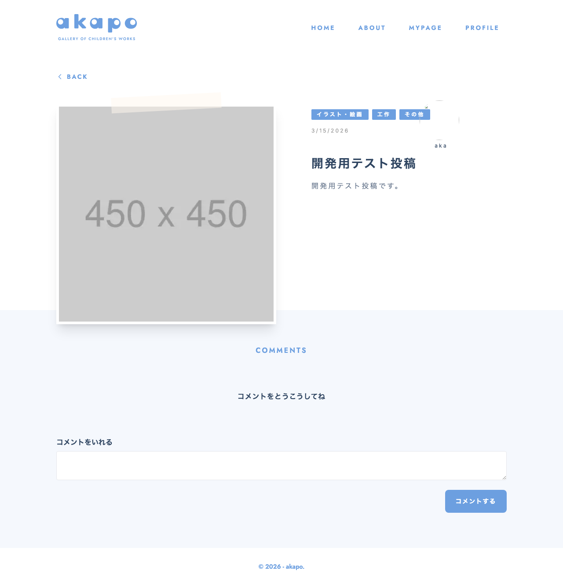

# 画面名
投稿詳細

---

---

# 必須構成

## 1. 画面概要
投稿の詳細情報を表示する画面です。投稿の内容、投稿者情報、コメント一覧、新規コメント投稿フォームが含まれています。

## 2. URL
`/posts/:id`

## 3. フォーム項目・表示要素
- 投稿タイトル
- 投稿本文
- 投稿者名
- 投稿者アイコン
- 投稿カテゴリ
- 投稿日時
- コメント一覧
- 新規コメント投稿フォーム

## 4. 初期表示・デフォルト値
- 投稿IDに対応する投稿データを取得して表示する
- コメント一覧は投稿IDに紐づくコメントデータを取得して表示する
- 新規コメント投稿フォームは初期状態で空の状態で表示する

## 5. ユーザー操作
- 投稿者名をクリックすると、その投稿者の投稿一覧ページ(`/?user=投稿者名`)に遷移する
- 「BACK」ボタンをクリックすると、投稿一覧ページ(`/`)に遷移する
- コメント一覧の下部にある新規コメント投稿フォームに入力し、送信ボタンをクリックすると、新規コメントが投稿される

## 6. バリデーション・エラーハンドリング
- 新規コメント投稿フォームのバリデーションは行わない
- 投稿データの取得や新規コメントの投稿に失敗した場合は、エラーメッセージを表示する

## 7. 画面遷移
- 投稿者名をクリックすると、投稿一覧ページ(`/?user=投稿者名`)に遷移する
- 「BACK」ボタンをクリックすると、投稿一覧ページ(`/`)に遷移する

## 8. 使用しているコンポーネント
- `PostDetail`: 投稿の詳細情報を表示するメインコンポーネント
- `TagList`: 投稿のカテゴリを表示するコンポーネント
- `Photo`: 投稿の画像を表示するコンポーネント
- `StatusInfo`: ローディング状態やエラー状態を表示するコンポーネント
- `CommentsList`: 投稿に紐づくコメントの一覧を表示するコンポーネント
- `CreateComment`: 新規コメントを投稿するフォームを表示するコンポーネント

## 9. 使用しているHooks / Stores / API / Schema
- `useParams`: URLパラメータからIDを取得するためのHook
- `usePostStore`: 投稿データの管理に使用するStore
- `useCommentStore`: コメントデータの管理に使用するStore
- `useRequireAuth`: ユーザー認証状態を確認するためのHook
- `fetchPost`: 投稿データを取得するためのAPI
- `fetchComments`: コメントデータを取得するためのAPI

## 10. 補足・制約
- 認証されていない場合は、ログインページ(`/login`)に遷移する
- 投稿データの取得や新規コメントの投稿に失敗した場合は、エラーメッセージを表示する

<!-- META -->
- 画面ID: post-detail
- 最終更新日: 2026-03-27
<!-- /META -->