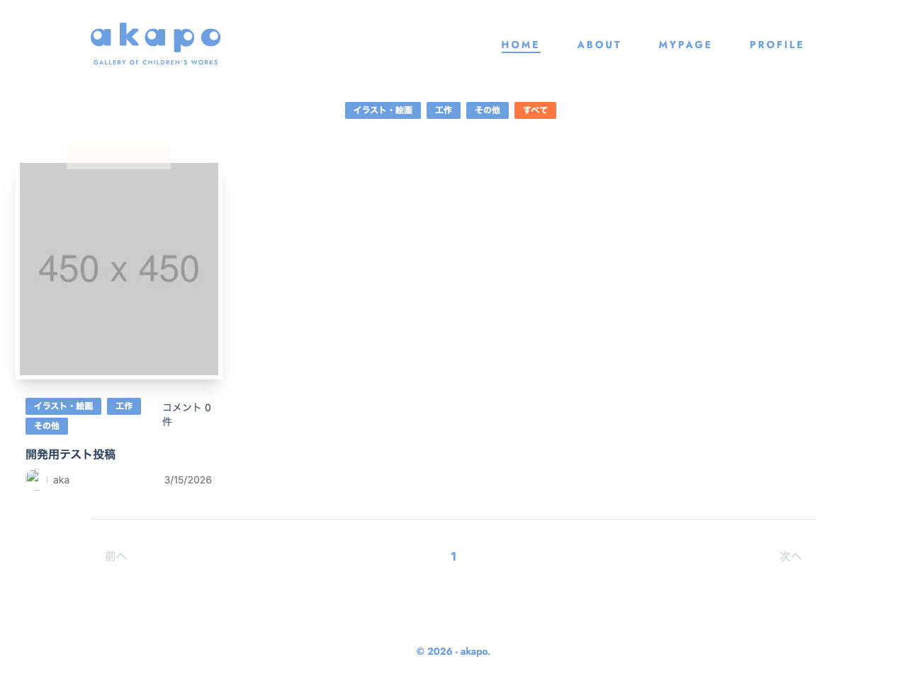

# 画面名
投稿一覧

---

---

# 必須構成

## 1. 画面概要
- ユーザーが投稿した記事の一覧を表示する画面です。
- 投稿の一覧表示、カテゴリーフィルター、ユーザーフィルター、ページネーションなどの機能を提供します。

## 2. URL
- `/posts`

## 3. フォーム項目・表示要素
- 投稿一覧
  - 投稿の画像
  - 投稿のタイトル
  - 投稿者名
  - 投稿日
  - カテゴリー
  - コメント数
  - 新着コメントフラグ
- カテゴリーフィルター
- ユーザーフィルター
- ページネーション

## 4. 初期表示・デフォルト値
- 投稿一覧は最新の投稿から順に表示されます。
- カテゴリーフィルターとユーザーフィルターはデフォルトでは設定されていません。
- ページネーションは1ページ目が初期表示されます。

## 5. ユーザー操作
- 投稿をクリックすると、投稿詳細ページに遷移します。
- カテゴリーフィルターを選択すると、選択したカテゴリーの投稿のみが表示されます。
- ユーザーフィルターを選択すると、選択したユーザーの投稿のみが表示されます。
- ページネーションのリンクをクリックすると、該当のページの投稿が表示されます。

## 6. バリデーション・エラーハンドリング
- 投稿の取得に失敗した場合は、エラーメッセージを表示します。
- 投稿データがない場合は、空の状態を表示します。

## 7. 画面遷移
- 投稿をクリックすると、投稿詳細ページ(`/posts/:id`)に遷移します。
- ユーザーフィルターのリンクをクリックすると、ユーザー投稿一覧ページ(`/?user=:userName`)に遷移します。

## 8. 使用しているコンポーネント
- `PostListPage`: 投稿一覧ページのメインコンポーネント
- `FilterNav`: カテゴリーフィルターとユーザーフィルターを提供するコンポーネント
- `PostList`: 投稿一覧を表示するコンポーネント
- `StatusInfo`: 読み込み中、エラー、空の状態を表示するコンポーネント
- `PageNation`: ページネーションを提供するコンポーネント
- `PhotoList`: 投稿の画像を表示するコンポーネント
- `TagList`: 投稿のカテゴリーを表示するコンポーネント

## 9. 使用しているHooks / Stores / API / Schema
- Hooks:
  - `usePostStore`: 投稿データの管理
  - `useCategoryFilter`: カテゴリーフィルターの状態管理
  - `usePostsFilter`: ユーザーフィルターの状態管理
  - `usePostsPage`: ページネーションの状態管理
  - `useRequireAuth`: 認証状態の管理
- API:
  - `fetchPosts`: 投稿データの取得
  - `fetchComments`: 投稿のコメント情報の取得
- Schema:
  - `Post`: 投稿データのスキーマ
  - `PostWithComments`: 投稿データにコメント情報を追加したスキーマ

## 10. 補足・制約
- 認証が必要な画面です。未ログインの場合はログインページに遷移します。
- 投稿の取得は、カテゴリーフィルターやユーザーフィルターがある場合は全件取得してからクライアント側でフィルタリングを行います。
- 新着コメントフラグは、投稿作成から24時間以内のコメントがある場合に表示されます。

<!-- META -->
- 画面ID: post-list
- 最終更新日: 2026-03-15
<!-- /META -->