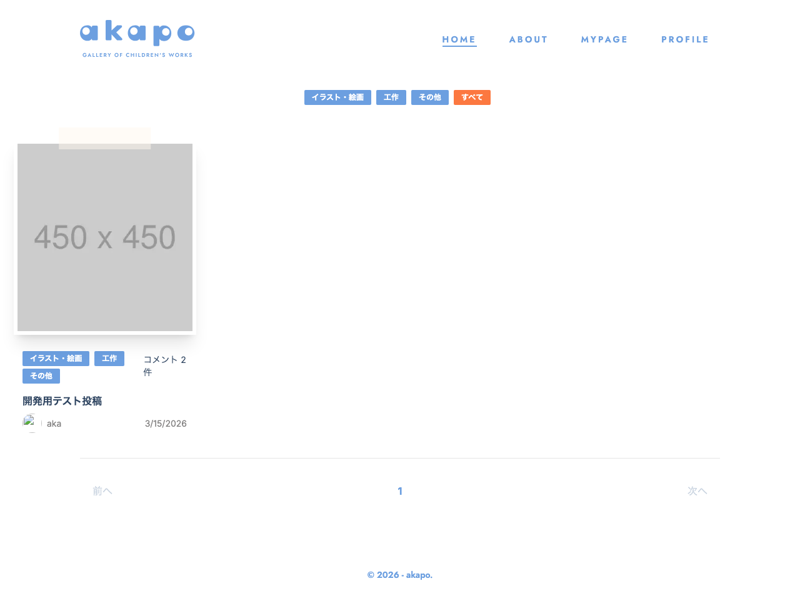

# Feature名

posts



## Feature概要

投稿（Post）の作成・一覧表示・詳細表示・編集・削除・ユーザー別一覧を担うコアな Feature。カテゴリフィルタ・ユーザーフィルタ・ページネーションを備えた一覧、画像アップロード付きの作成・編集フォーム、コメント表示を含む詳細ページで構成される。

## 主要な責務

- **投稿一覧**: 全投稿取得・カテゴリフィルタ・ユーザーフィルタ・ページネーション
- **投稿作成**: 画像アップロード・圧縮・タイトル/本文/カテゴリの入力・API 送信
- **投稿詳細**: 投稿情報・画像・コメント一覧の表示。コメント作成フォームを内包
- **投稿編集**: 既存投稿の取得・フォーム反映・画像差し替え・API 送信
- **ユーザー別一覧**: ログインユーザーの投稿一覧表示と削除
- **認証ガード**: `useRequireAuth` により未ログインユーザーを `/login` にリダイレクト

## 提供するコンポーネント

| コンポーネント | 説明 |
|---|---|
| `CreatePostPage` | 投稿作成ページのルートコンポーネント |
| `CreatePost` | 投稿作成フォーム。画像選択・圧縮・カテゴリ選択・API 送信 |
| `PostDetailPage` | 投稿詳細ページ。URLパラメータから `id` を取得し `PostDetail` に渡す |
| `PostDetail` | 投稿詳細表示。投稿情報・コメント一覧・コメント作成フォームを含む |
| `PostListPage` | 投稿一覧ページ。フィルタ・ページネーション付き |
| `PostList` | 投稿カードのグリッド表示 |
| `FilterNav` | カテゴリフィルタナビゲーション |
| `PatchPostPage` | 投稿編集ページのルートコンポーネント。URLパラメータから `id` を取得 |
| `PatchPost` | 投稿編集フォーム。既存データの取得・反映・画像差し替え・API 送信 |
| `UserPostListPage` | ユーザー別投稿一覧ページのルートコンポーネント |
| `UserPostList` | ログインユーザーの投稿一覧と削除ボタン |

## 提供するHooks

| Hook | 説明 |
|---|---|
| `usePostForm` | `react-hook-form` + `zodResolver(NewPostSchema)` による投稿フォーム管理。作成・編集で共用 |
| `useRequireAuth` | `localStorage` のトークン確認。未認証時は `/login` へリダイレクト。`isAuthChecked` を返す |
| `useCategoryFilter` | URLクエリパラメータ `category` を取得・正規化する |
| `usePostsFilter` | URLクエリパラメータ `user` を取得・正規化する |
| `usePostsPage` | URLクエリパラメータ `page`・`limit` を取得し `offset` を計算する |

## 状態管理（Store）

| Store | 使用箇所 | 操作 |
|---|---|---|
| `usePostStore` | `PostListPage`, `UserPostList` | `setPosts`, `setUserPosts`, `removePost`, `isLoading`, `error`, `setLoading`, `setError` |
| `useCommentStore` | `PostDetail` | `setComments` でコメント一覧をセット |
| `useAuthStore` | `PostDetail`, `UserPostList` | `userProfile` でログインユーザー情報を参照 |

## 使用している外部依存

| 依存 | 用途 |
|---|---|
| `next/navigation` (`useRouter`, `useParams`, `useSearchParams`) | リダイレクト・URLパラメータ取得・クエリ文字列取得 |
| `next/link` (`Link`) | 各ページへのリンク |
| `next/image` (`Image`) | 投稿画像・ユーザーアイコンの最適化表示 |
| `react-hot-toast` | 成功・失敗トースト通知 |
| `browser-image-compression` | 投稿画像の圧縮 |
| `@hookform/resolvers/zod` | Zod スキーマによるフォームバリデーション |
| `@/shared/schemas` (`NewPost`, `NewPostSchema`) | 投稿フォームのバリデーションスキーマ |
| `@/shared/api/fetchData` | `fetchPosts`, `fetchPost`, `fetchComments`, `createPost`, `patchPost`, `uploadImage`, `deletePost` |
| `@/shared/stores` (`usePostStore`, `useCommentStore`, `useAuthStore`) | 状態管理 |
| `@/shared/components/statusInfo` (`StatusInfo`) | ローディング・エラー状態の表示 |
| `@/shared/components/selectBox` (`SelectBox`) | カテゴリ選択UI |
| `@/shared/components/tagList` (`TagList`) | 投稿カードのタグ表示 |
| `@/shared/components/photo` (`Photo`) | 投稿画像表示 |
| `@/shared/components/photoList` (`PhotoList`) | 投稿一覧の画像表示 |
| `@/shared/components/button` (`Button`) | 共通ボタン |
| `@/shared/components/font` (`jost`) | タイトルフォント |
| `@/shared/constants/categories` (`CATEGORIES_TYPES`) | カテゴリ一覧定数 |
| `@/shared/constants/image` (`IMAGE_COMPRESSION_OPTIONS`) | 画像圧縮オプション |
| `@/shared/lib/validateImageFile` | 画像ファイルバリデーション |
| `@/features/comments` (`CreateComment`, `CommentsList`) | コメント作成・一覧（PostDetail 内で使用） |

## 使用されている箇所（routes）

| ルート | 説明 |
|---|---|
| `/` | `PostListPage`（投稿一覧） |
| `/posts/[id]` | `PostDetailPage`（投稿詳細） |
| `/posts/new` | `CreatePostPage`（投稿作成） |
| `/posts/[id]/edit` | `PatchPostPage`（投稿編集） |
| `/mypage` | `UserPostListPage` が `UsersPage` 内で使用される |

## 補足・制約

- `useRequireAuth` は `localStorage.getItem("token")` でトークンを確認する。SSR 非対応（クライアントサイドのみ）
- `useCategoryFilter`・`usePostsFilter`・`usePostsPage` はすべて `useSearchParams` に依存するため `Suspense` 境界が必要
- ページネーションは `page`・`limit` クエリパラメータで制御。デフォルトは `page=1`・`limit=8`
- `PatchPost` は編集時に画像を差し替える場合のみ `uploadImage` を呼び出し、差し替えなしの場合は既存 URL をそのまま使用する
- `UserPostList` の削除は `deletePost`（`deletePosts.ts` のエクスポート名は `deletePost`）を呼び出す

<!-- META -->
Feature ID: posts
最終更新日: 2026-04-11
<!-- /META -->

# 実装コード

### list/hooks/useCategoryFilter.ts

```ts
import { useSearchParams } from "next/navigation";

export const useCategoryFilter = () => {
  const searchParams = useSearchParams();
  const category = searchParams.get("category");
  const normalizedCategory =
    category === null || category === "" ? null : category;
  return {
    category: normalizedCategory,
    isFiltered: normalizedCategory !== null,
  };
};
```

### list/hooks/usePostsFilter.ts

```ts
import { useSearchParams } from "next/navigation";

export const usePostsFilter = () => {
  const searchParams = useSearchParams();
  const userName = searchParams.get("user");
  const normalizedUserPosts =
    userName === null || userName === "" ? null : userName;
  return {
    userName: normalizedUserPosts,
    isFiltered: normalizedUserPosts !== null,
  };
};
```

### list/hooks/usePostsPage.ts

```ts
import { useSearchParams } from "next/navigation";

export const usePostsPage = () => {
  const searchParams = useSearchParams();
  const page = searchParams.get("page") || "1";
  const limit = searchParams.get("limit") || "8";
  const normalizedPage = Math.max(Number(page), 1);
  const normalizedLimit = Math.max(Number(limit), 1);
  const offset = (normalizedPage - 1) * normalizedLimit;
  return {
    page: normalizedPage,
    limit: normalizedLimit,
    offset,
  };
};
```

### shared/hooks/useRequireAuth.ts

```ts
import { useEffect, useState } from "react";
import { useRouter } from "next/navigation";

export function useRequireAuth(): boolean {
  const router = useRouter();
  const [checked, setChecked] = useState<boolean>(false);
  useEffect(() => {
    const token = localStorage.getItem("token");
    if (!token) {
      router.push("/login");
    } else {
      setChecked(true);
    }
  }, []);
  return checked;
}
```

### shared/hooks/usePostForm.ts

```ts
import { useForm } from "react-hook-form";
import { zodResolver } from "@hookform/resolvers/zod";
import { NewPost, NewPostSchema } from "@/shared/schemas";

export const usePostForm = (defaultValues?: Partial<NewPost>) => {
  const {
    register,
    handleSubmit,
    formState: { errors },
    control,
    reset,
  } = useForm<NewPost>({
    resolver: zodResolver(NewPostSchema),
    mode: "onBlur",
    defaultValues: defaultValues || {
      title: "",
      body: "",
    },
  });
  return { register, handleSubmit, control, errors, reset };
};
```
