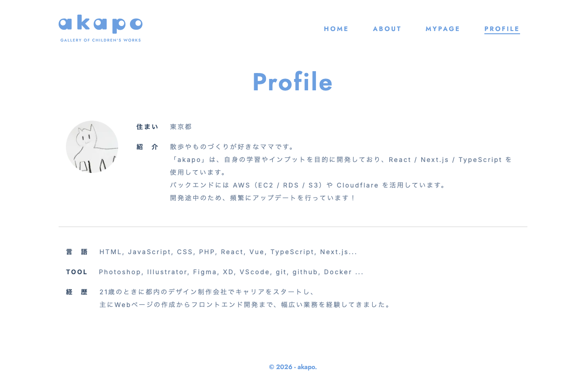

# 画面名
Profile

# 必須構成

## 1. 画面概要
このページは、ユーザーのプロフィールを表示する画面です。ユーザーの基本情報や経歴、スキルなどが確認できます。

## 2. 

## 3. URL
/profile

## 4. フォーム項目・表示要素
- ユーザー画像
- 住まい
- 自己紹介
- 言語
- 使用ツール
- 経歴

## 5. 初期表示・デフォルト値
- ユーザー画像、住まい、自己紹介、言語、使用ツール、経歴が初期表示されます。

## 6. ユーザー操作
- このページはユーザー情報の閲覧専用です。ユーザーは情報を編集することはできません。

## 7. バリデーション・エラーハンドリング
- 特になし

## 8. 画面遷移
- このページは単独で表示されます。他の画面からの遷移はありません。

## 9. 使用しているコンポーネント
- Image
- jost (フォントコンポーネント)

## 10. 使用しているHooks / Stores / API / Schema
- 特になし

## 11. 補足・制約
- 本画面はユーザーのプロフィール情報を表示するためのものです。
- 情報の編集や更新は別の画面で行う必要があります。

<!-- META -->
- 画面ID: profile
- 最終更新日: 2026-03-15
<!-- /META -->