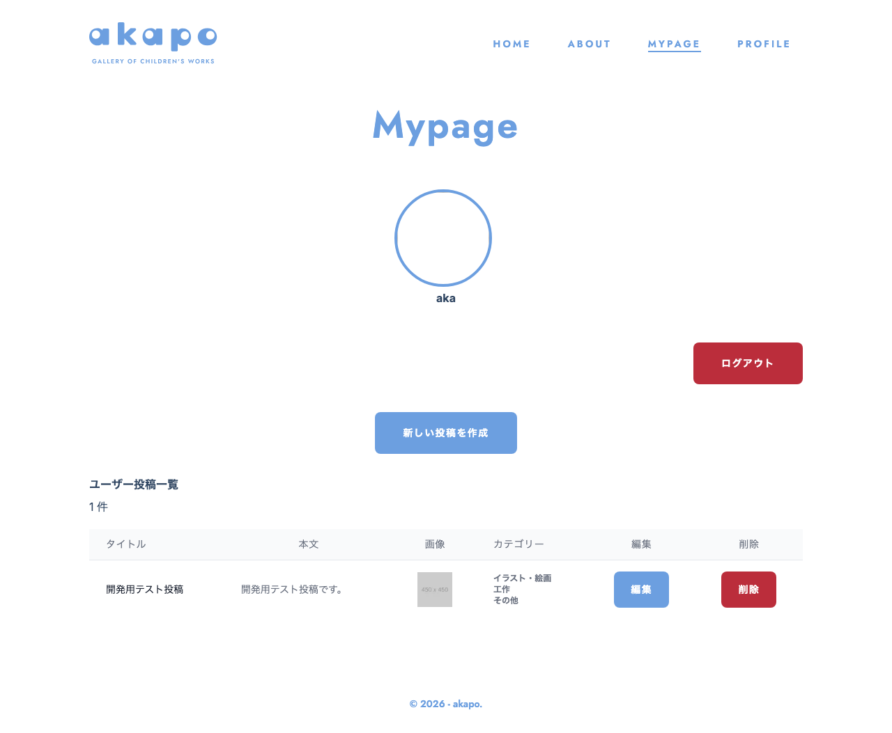

# 画面名
ユーザーページ

---

---

# 必須構成

## 1. 画面概要
ユーザーのマイページを表示する画面です。ユーザーの基本情報と、ユーザーが投稿した記事の一覧を表示します。

## 2. URL
/mypage

## 3. フォーム項目・表示要素
- ユーザーのアイコン画像
- ユーザーの名前
- ログアウトボタン
- 新しい投稿を作成するボタン
- ユーザーの投稿一覧

## 4. 初期表示・デフォルト値
- ユーザーの基本情報は初期表示時に取得して表示する
- ユーザーの投稿一覧は初期表示時に取得して表示する

## 5. ユーザー操作
- ログアウトボタンをクリックするとログアウトし、ログイン画面に遷移する
- 新しい投稿を作成するボタンをクリックすると、新規投稿画面に遷移する

## 6. バリデーション・エラーハンドリング
- ユーザー情報の取得に失敗した場合はエラーメッセージを表示する
- 投稿の取得に失敗した場合はエラーメッセージを表示する

## 7. 画面遷移
- ログアウトボタンをクリックすると、ログイン画面(/login)に遷移する
- 新しい投稿を作成するボタンをクリックすると、新規投稿画面(/posts/new)に遷移する

## 8. 使用しているコンポーネント
- User
- Button
- StatusInfo
- Image
- UserPostListPage

## 9. 使用しているHooks / Stores / API / Schema
- useAuthStore
- usePostStore
- useRequireAuth
- fetchUserData
- fetchUserPosts
- UserProfile
- Post

## 10. 補足・制約
- ユーザーがログインしていない場合は、ログイン画面に遷移する
- ユーザー情報と投稿一覧の取得は非同期処理で行う

<!-- META -->
- 画面ID: user-page
- 最終更新日: 2026-03-15
<!-- /META -->